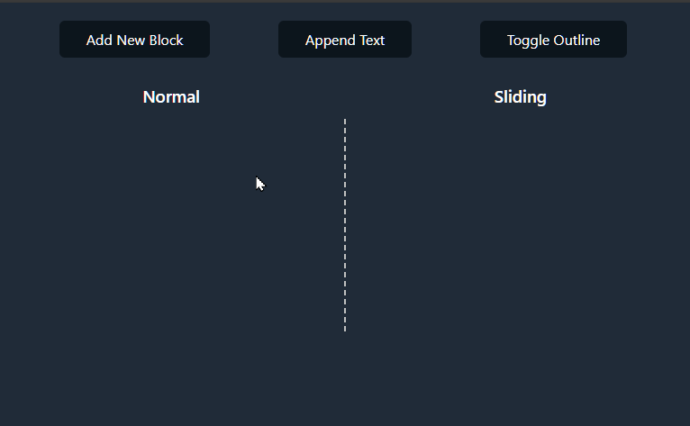

# Sliding TextBox Demo (Blazor)

This is a Blazor WebAssembly demo that showcases a smooth scrolling implementation to improve readability in translated subtitle systems. (You can see the React version [here](https://github.com/sample-by-jsakamoto/React-SlidingTextBox).)

When new text is added, typical implementations cause existing text to jump abruptly, making it difficult to read. The SlidingTextBox component solves this problem with smooth animation display.

**Left (Normal)**: Abrupt scrolling  
**Right (Sliding)**: Smooth slide-in animation

[Demo](https://sample-by-jsakamoto.github.io/Blazor-SlidingTextBox/)




## Getting Started

### Prerequisites

.NET SDK 9.0 or later

### Installation

1. Clone the repository:

```bash
git clone https://github.com/sample-by-jsakamoto/Blazor-SlidingTextBox.git
```

### Running the Application

2. Navigate to the project directory:

```bash
cd ./Blazor-SlidingTextBox
```

3. Start the development server:

```bash
dotnet watch
```

## License

This project is released into the public domain under [The Unlicense](LICENSE).
